# Athena-ide package

[](https://opensource.org/licenses/MIT)
[](https://travis-ci.org/aergoio/athena-ide-atom/)

A package for writing smart contract in aergo using atom

## Compatible Aergo Version

v1.0.x

## Features

- [X] Syntax highlighting
- [X] Basic autocomplete
- [X] Basic linter
- [X] Compile
- [X] Deploy smart contract
- [X] Execute smart contract
- [X] Query smart contract result
- [X] Advanced autocomplete (lua specific, nested table)

- [ ] Advanced linter (recommandation)
- [ ] Simulation


## How to use

### Installation

With atom package manager

```sh
$ apm install athena-ide-atom
```

With atom ui


### Open panel

Open Athena Ide View: `Alt + Shift + L`

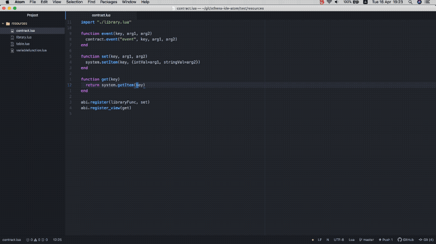

Open with menu bar

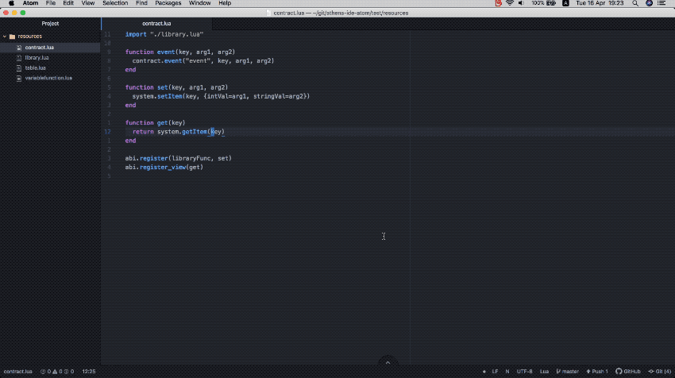

### AutoComplete

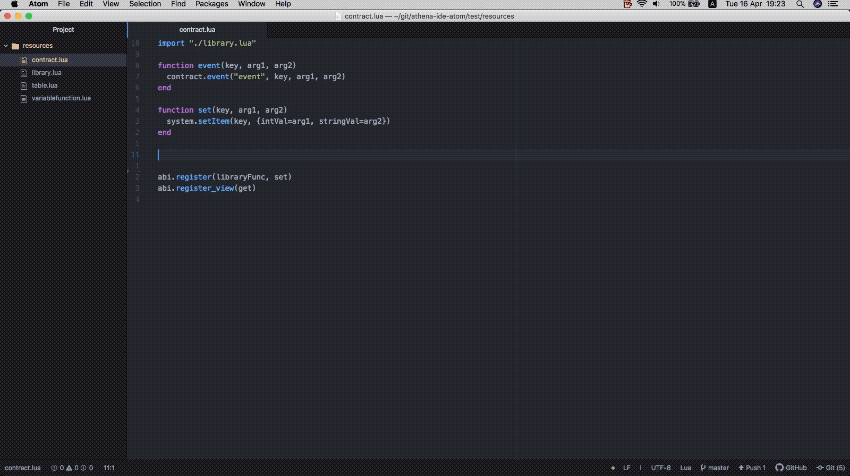

### Lint


### Node Managing

New

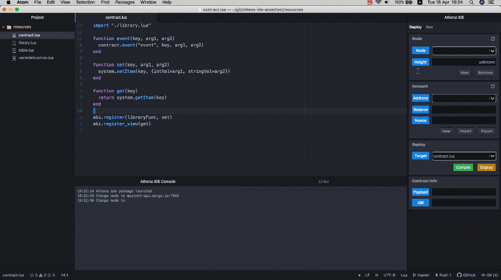

Remove

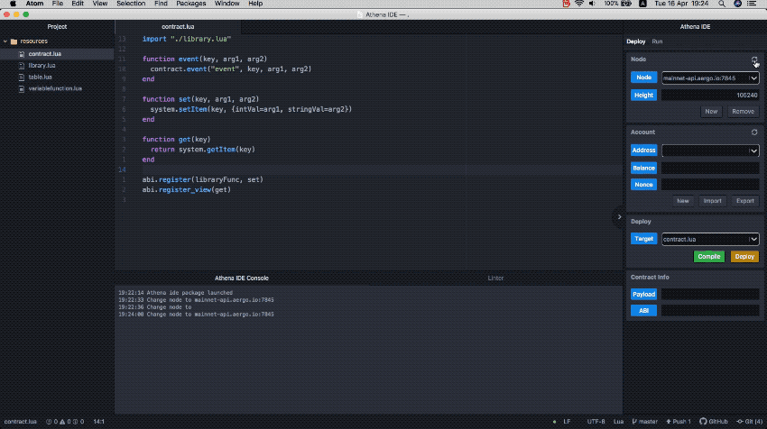

### Account Managing

New

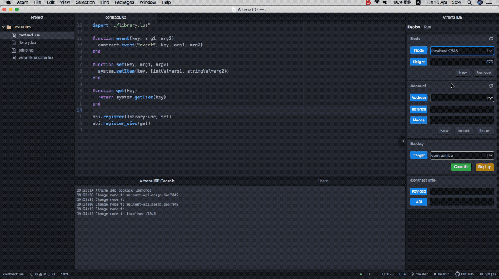

Import

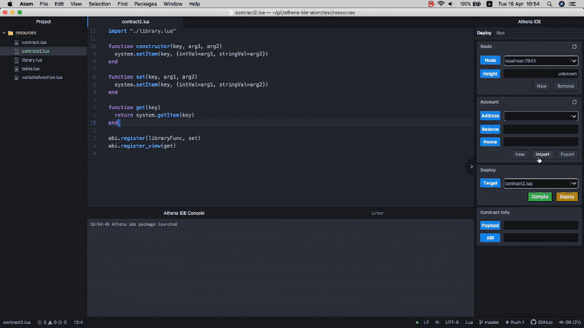

Export

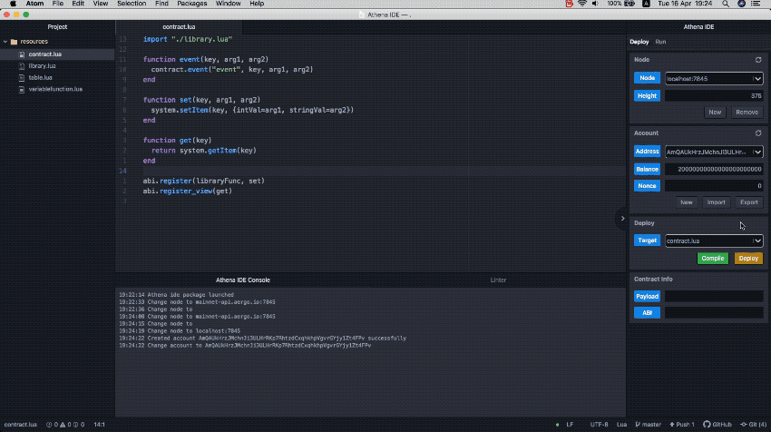

### Compile

Compile current file: `f7`

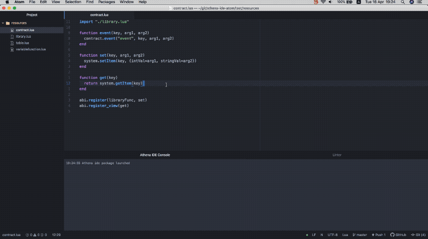

By pressing compile button

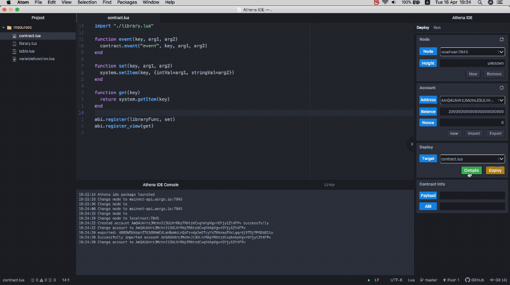

### Deploy

Without constructor arguments

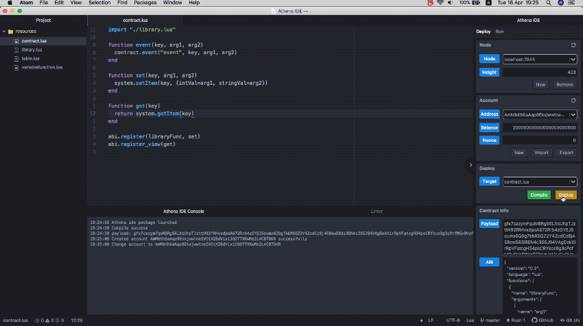

With constructor arguments

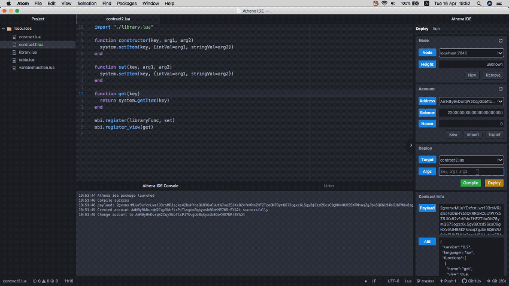

### Contract Managing

Import

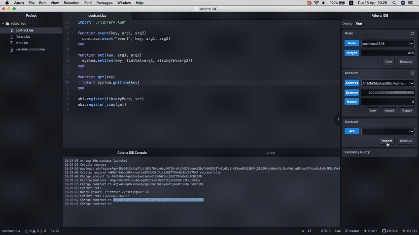

Remove

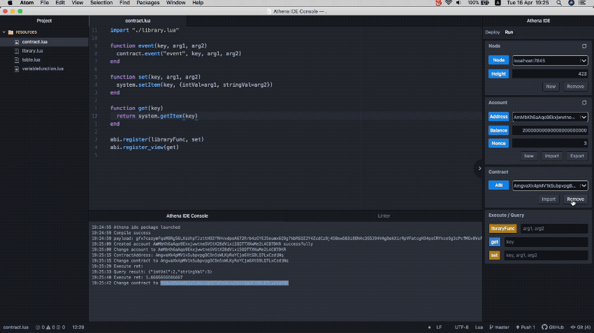

### Execute / Query

Execute

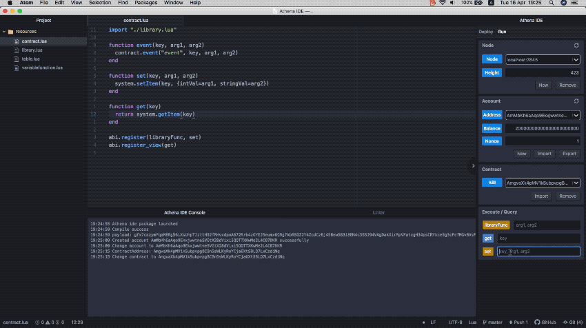

Query

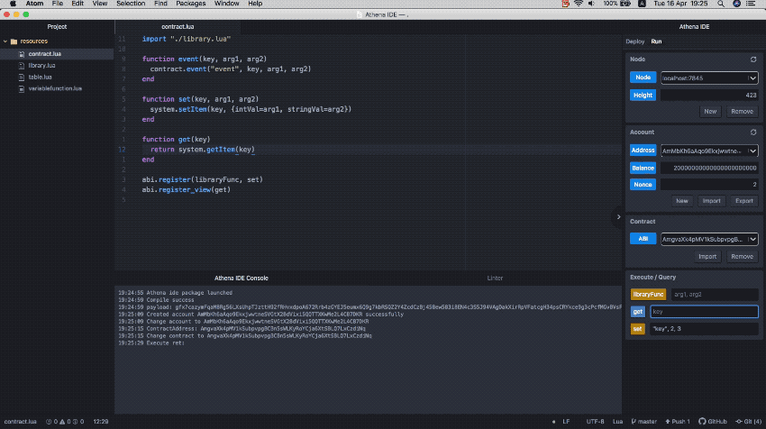

## Build

Clone

```sh
$ git clone https://github.com/aergoio/athena-ide-atom.git
```

Install dependency

```sh
$ npm install
```

Run lint

```sh
$ npm run lint
```

Run test (including lint)

```sh
$ npm run test
```

Link to local atom package

```sh
$ apm link
```
