# Athena-ide package

[](https://opensource.org/licenses/MIT)
[](https://travis-ci.org/aergoio/athena-ide-atom/)
[](https://atom.io/packages/athena-ide-atom)
[](https://atom.io/packages/athena-ide-atom)

A package for writing smart contract in aergo using atom

## Compatibility

- Atom: v1.28 or higher
- Aergo: v1.3.0 or higher

Need to rebuild for atom compatible electron version for grpc native modules in a herajs

- atom 1.28.0: electron 2.0.0
- atom 1.39.0: electron 3.1.1
- atom 1.41.0: electron 4.2.0

Check release notes of atom : https://github.com/atom/atom/releases

## Features

- [X] Syntax highlighting
- [X] Basic autocomplete
- [X] Basic linter
- [X] Compile
- [X] Deploy smart contract
- [X] Execute smart contract
- [X] Query smart contract result
- [X] Advanced autocomplete (lua specific, nested table)

- [ ] Advanced linter (recommandation)
- [ ] Simulation

`./screenshots` holds all the supported features

## Build from source

- Install dependency: `npm install`
- Lint: `npm run lint`
- Run test (including lint): `npm run test`
- Link and run as dev mode (real time ui changes)
  - Atom package link: `apm link`
  - Run dev mode: `npm run dev`
- Build dist: `npm run build`

## Product

### Install

With atom package manager

```sh
> apm install athena-ide-atom
```

With atom ui


### Open panel

Open Athena Ide View: `Alt + Shift + L`

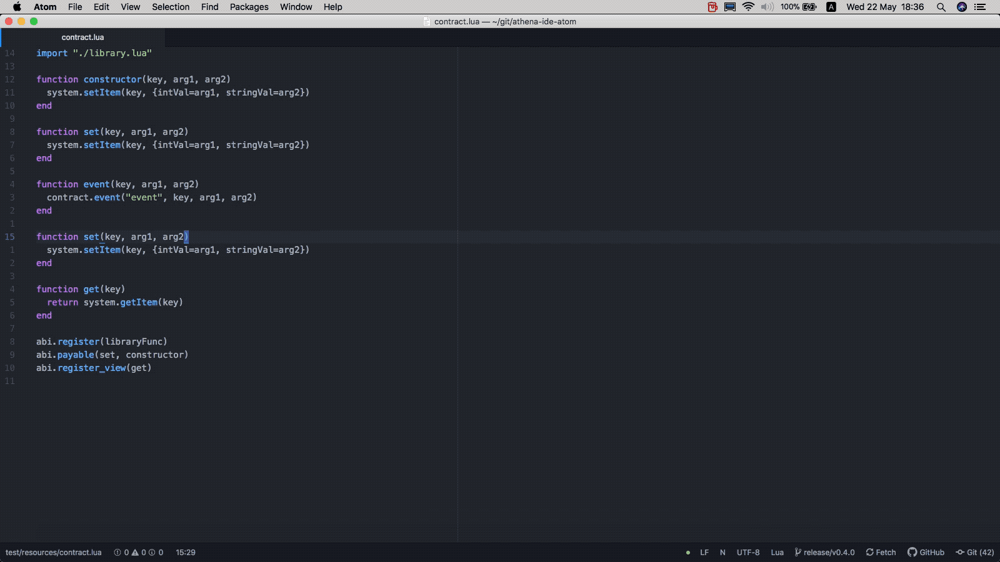

Open with menu bar

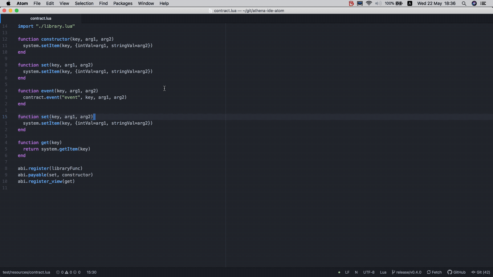

### AutoComplete


### Lint


### Node Managing

New

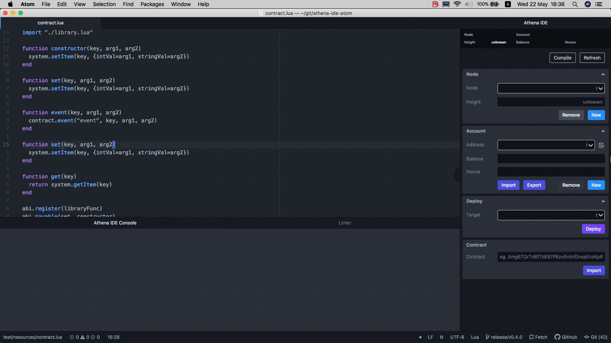

Remove

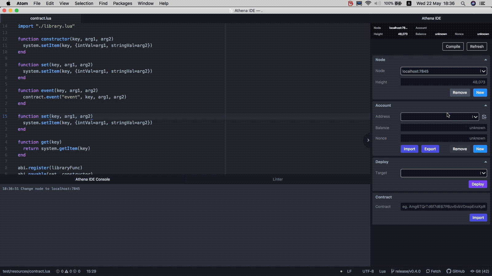

### Account Managing

New


Import

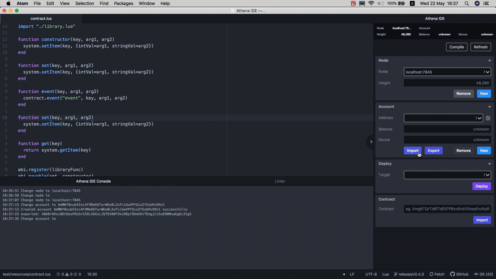

Export

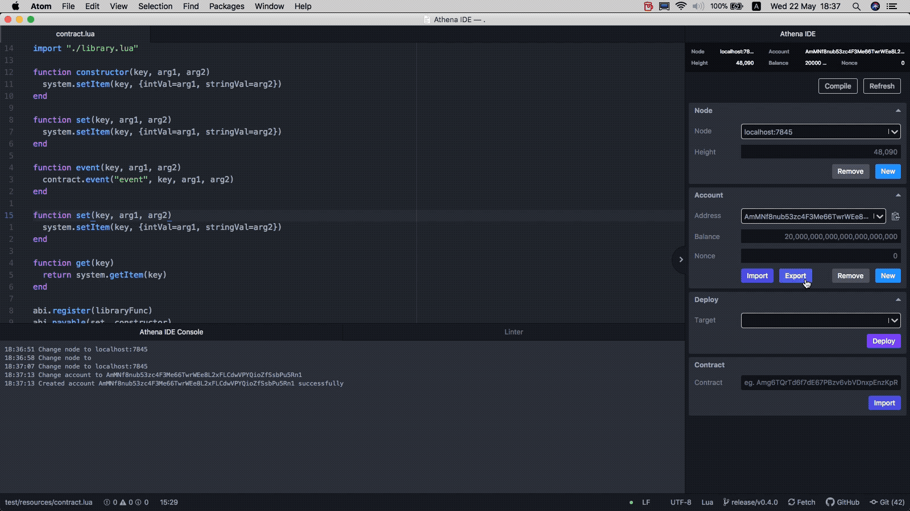

Remove

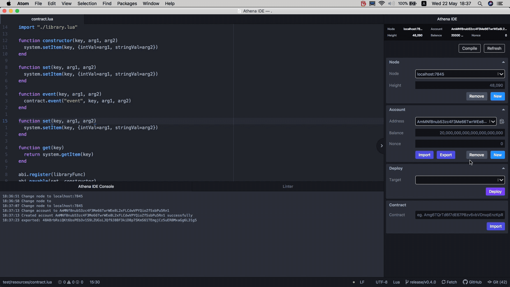

### Compile

Compile current file: `f7`

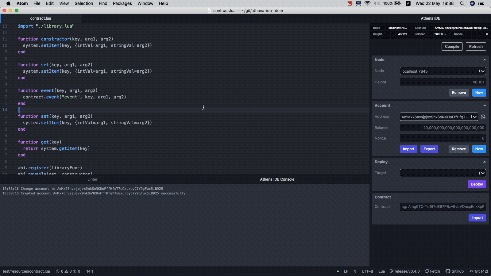

By pressing compile button

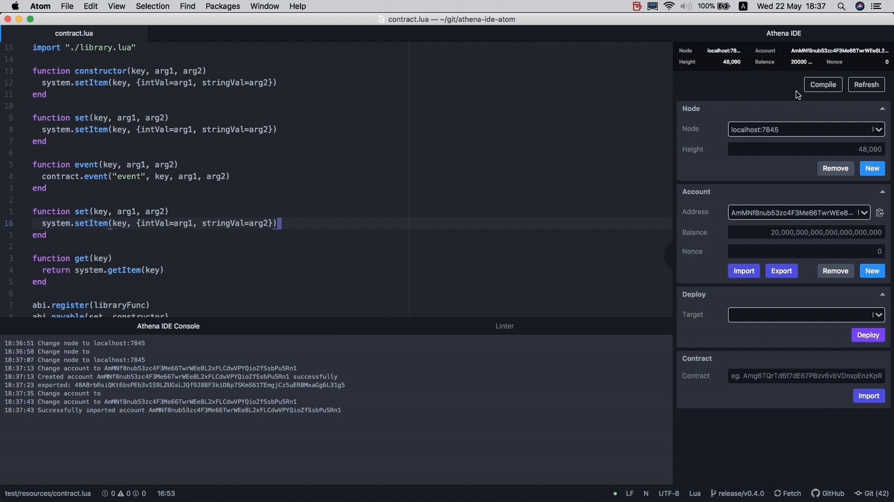

### Deploy & Import

Deploy without constructor arguments

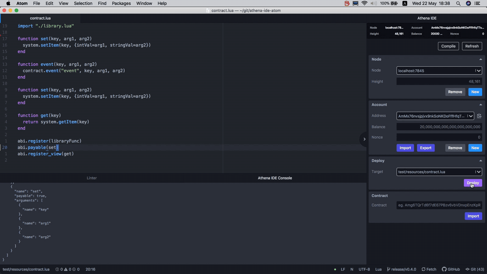

Deploy with constructor arguments

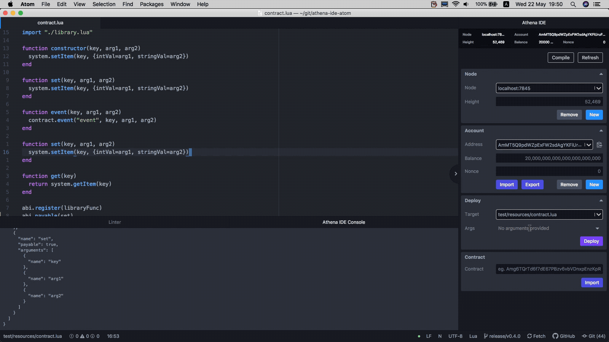

Deploy With constructor arguments and amount

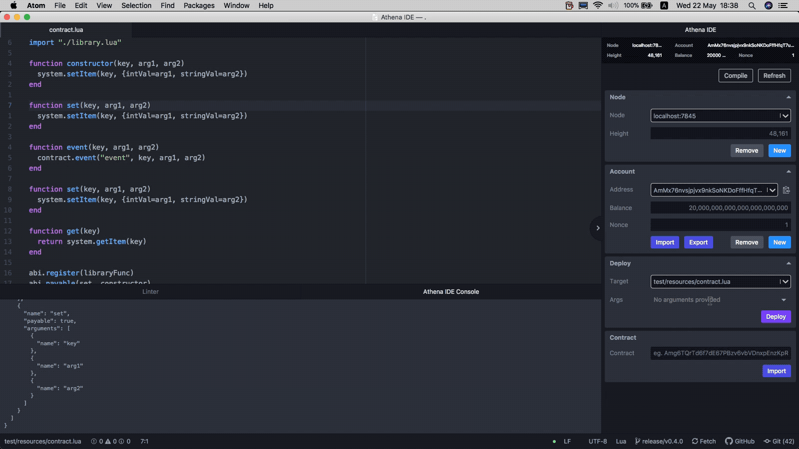

Import already deployed contract

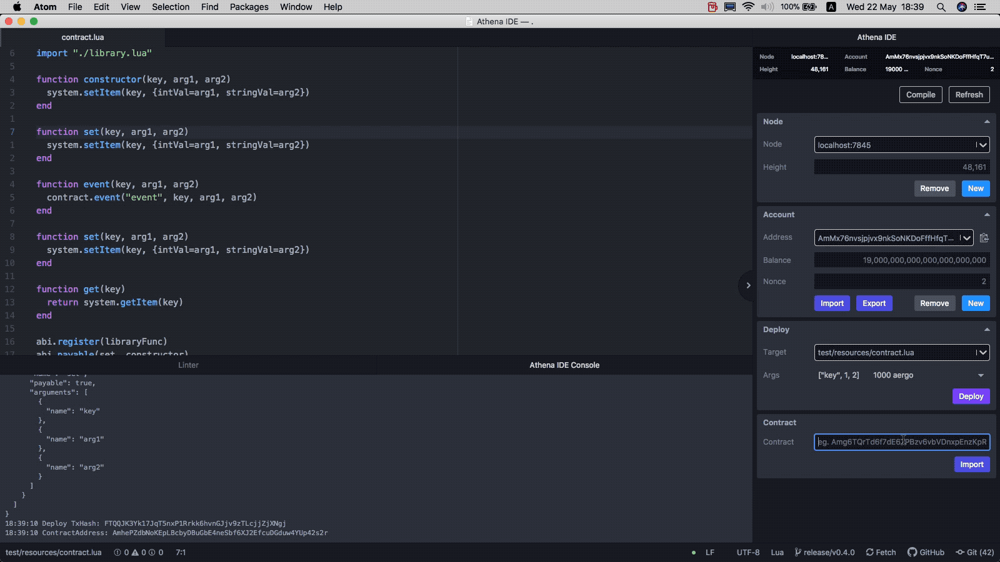

Remove contract

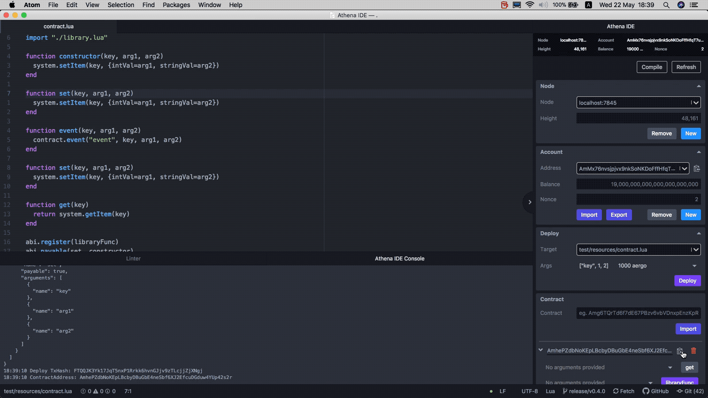

### Execute / Query

Execute contract


Execute contract with amount

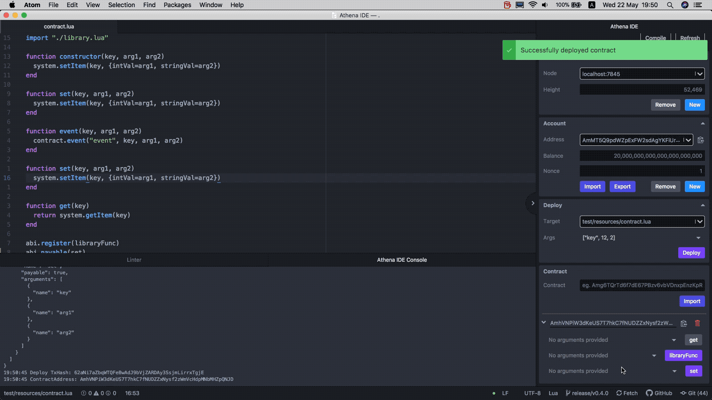

Query contract

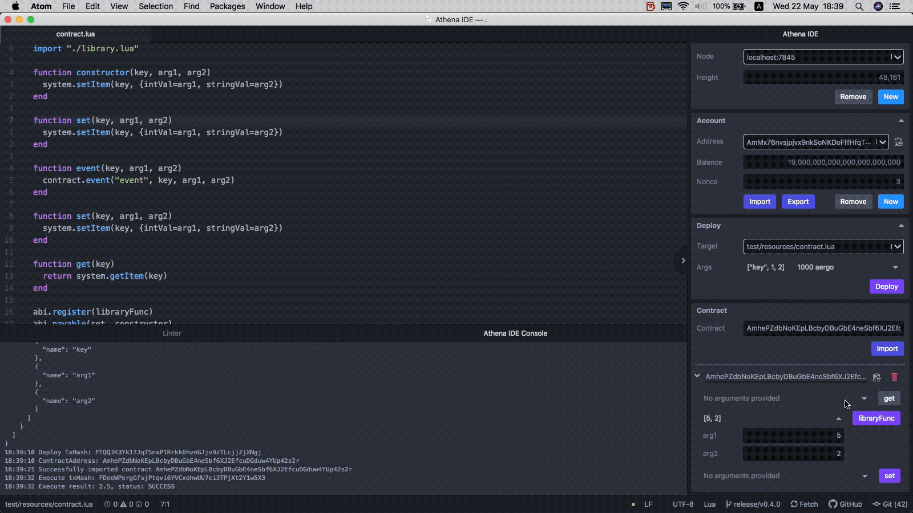

## Contribution

Do not write custom scripts as external file like

```json
  "scripts": {
    "some-script": "scripts/some-script.sh",
  },
```

It would be broken in windows cmd.exe. Which causes package install failure in windows.

Following single rule, feel free to make any pull requests.
