Account
=======

You can configure an account which is deploying, executing and querying smart contract. An account have to have some aergo token to make transaction.

New
---

Click an new button

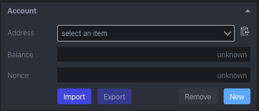

Click a ok button

.. image:: ../_static/img/new-account-2.png

Account created

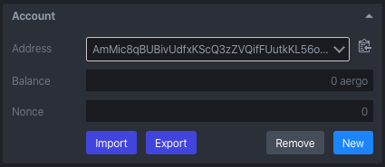

Import
------

You can import account with an aergo specific keystore format or wallet import format. For details of keystore format, see `aergo keystore proposal <https://github.com/aergoio/aergo/pull/102>`_.

KeyStore
^^^^^^^^

Click an import button

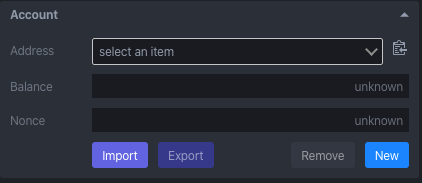

Click an add file button on popup

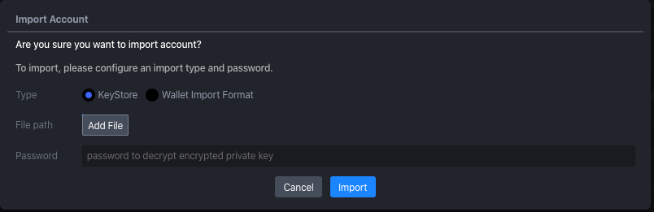

Select keystore file

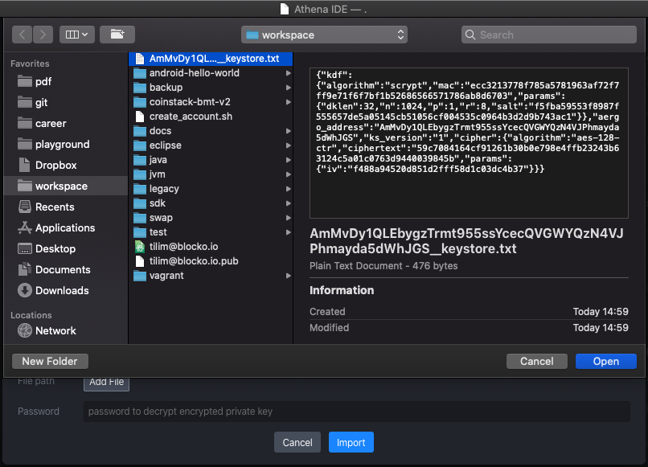

Enter password to decrypt keystore

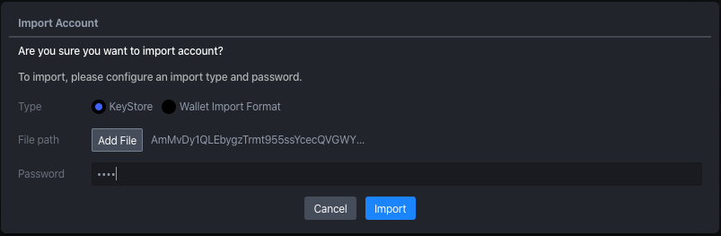

Account imported

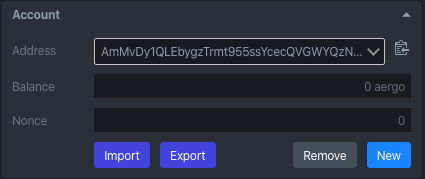

Wallet Import Format
^^^^^^^^^^^^^^^^^^^^

Click an import button

Enter wallet import format & password to decrypt it

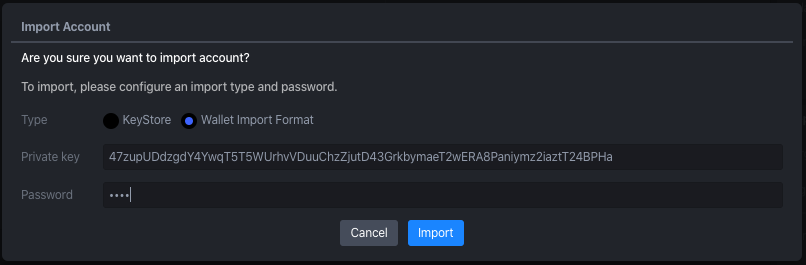

Account imported

Export
------

You can export account with an aergo specific keystore format or wallet import format. For details of keystore format, see `aergo keystore proposal <https://github.com/aergoio/aergo/pull/102>`_.

KeyStore
^^^^^^^^

Click an export button

.. image:: ../_static/img/export-account-keystore-1.png

Enter a password to encrypt

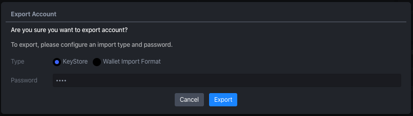

Choose save location

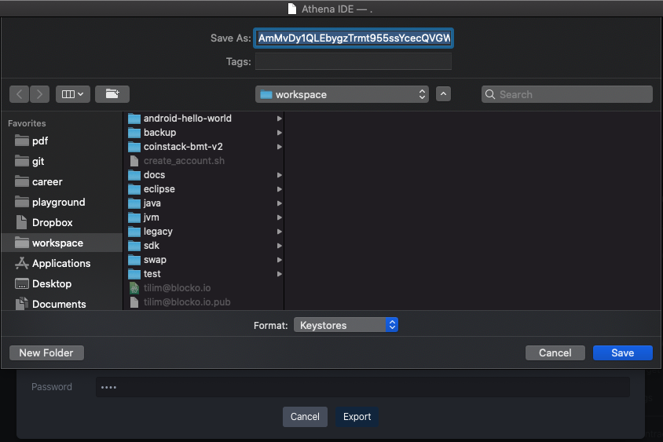

Wallet Import Format
^^^^^^^^^^^^^^^^^^^^

Click an export button

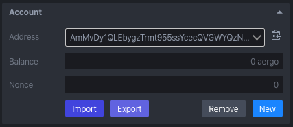

Enter a password to encrypt

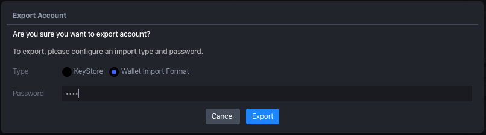

You can see wallet import format in a console

.. image:: ../_static/img/export-account-wif-3.png

Remove
------

Click an remove button

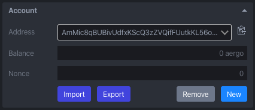

Click a ok button

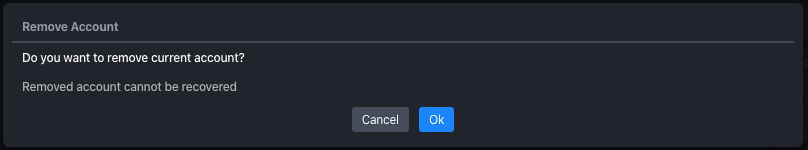

Account removed from list

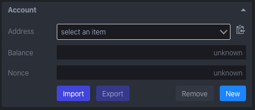
