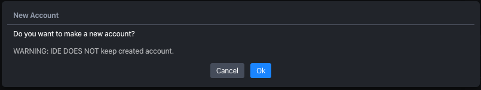
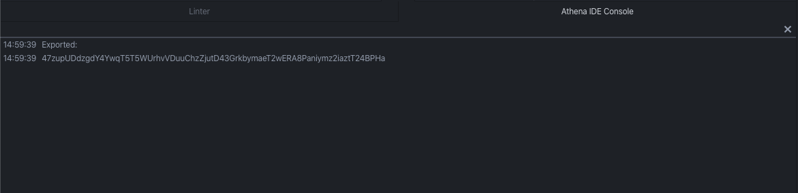

Account
=======

You can configure an account which is deploying, executing and querying smart contract. An account have to have some aergo token to make transaction.

New
---

Click an new button in an account panel.

Click a ok button.

You can see created account.

Import
------

You can import account with an aergo specific keystore format or wallet import format. For details of keystore format, see `aergo keystore proposal <https://github.com/aergoio/aergo/pull/102>`_.

KeyStore
^^^^^^^^

Click an import button on account panel.

Click an add file button on popup.

.. image:: ../_static/img/import-account-keystore-2.png

Select keystore file.

Enter password to decrypt keystore.

You can see imported account.

Wallet Import Format
^^^^^^^^^^^^^^^^^^^^

Click an import button on account panel.

.. image:: ../_static/img/import-account-wif-1.png

Enter wallet import format & password to decrypt it.

You can see imported account.

.. image:: ../_static/img/import-account-wif-3.png

Export
------

You can import account with an aergo specific keystore format or wallet import format. For details of keystore format, see `aergo keystore proposal <https://github.com/aergoio/aergo/pull/102>`_.

KeyStore
^^^^^^^^

Click an export button on account panel.

.. image:: ../_static/img/export-account-keystore-1.png

Enter a password to encrypt.

Choose save location.

Wallet Import Format
^^^^^^^^^^^^^^^^^^^^

Click an export button on account panel.

Enter a password to encrypt.

You can see wallet import format in a console.

Remove
------

Click an remove button in an account panel.

Click a ok button.

Account removed from list.

