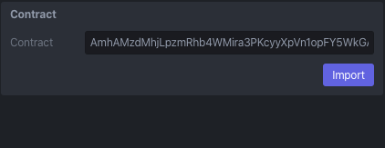
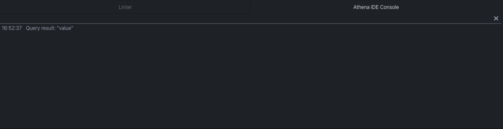
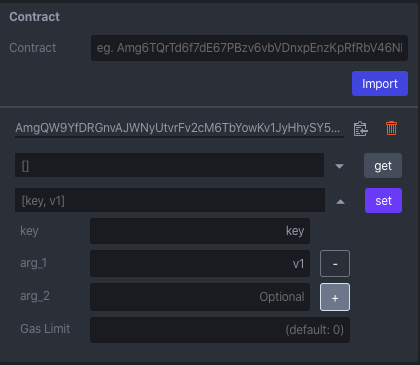

Contract
========

You can deploy/execute/query smart contract. Deploying and executing is done by making transaction. Make sure that you have enough aergo token to make transaction before deploying and executing contract.

Compile
-------

Before deploying contract, you have to compile by **clicking compile button** or **pressing F7**.

Deploy
------

After compiling contract, you can deploy contract.

Without args
^^^^^^^^^^^^

You can deploy contract without constructor arguments.

.. code-block:: lua

  -- no arguments
  function constructor()
    system.setItem("k1", "v1")
  end

  ...

With args
^^^^^^^^^

You can deploy contract with constructor arguments.

.. code-block:: lua

  -- arguments (key, value)
  function constructor(key, value)
    system.setItem(key, value)
  end

  ...

Gas limit
^^^^^^^^^

You can deploy contract with gas limit configuration. 0 limit means infinite (uses as much as possible).

Amount
^^^^^^

You can deploy contract with aergo token. Make sure constructor is registered as payable.

.. code-block:: lua

  function constructor()
    system.setItem("k1", "v1")
  end

  ...

  -- registered as payable
  abi.payable(constructor)

Import & Remove
---------------

Import
^^^^^^

You can import already deployed contract. 

Type contract address & click import button

Contract imported

Remove
^^^^^^

You can remove contract.

Click trash button

Contract removed

Execute
-------

Contract execution can change status of contract state db. Any function registered as register can be executed.

Without args
^^^^^^^^^^^^

You can execute contract without arguments.

.. code-block:: lua

  ...

  -- no arguments
  function setDefault()
    system.setItem("k1", "v1")
  end

  ...

  -- register as execution
  abi.register(setDefault)

With args
^^^^^^^^^

You can execute contract with arguments.

.. code-block:: lua

  ...

  -- arguments (key, value)
  function set(key, value)
    system.setItem(key, value)
  end

  ...

  -- register as execution
  abi.register(set)

Gas limit
^^^^^^^^^

You can execute contract with configuring gas limit.  0 limit means infinite (uses as much as possible).

Amount
^^^^^^

You can execute contract with aergo token. Make sure function is registered as payable.

.. code-block:: lua

  ...

  function run()
  end

  ...

  -- registered as payable
  abi.payable(run)

Fee delegation
^^^^^^^^^^^^^^

You can execute contract with fee delegation. When contract is executed with fee delegation, the contract pays fee on behalf of contract executor. Make sure function is registered as fee_delegation and a contract has enough aergo token.

.. code-block:: lua

  ...

  function run()
  end

  -- registered as fee delegation
  abi.fee_delegation(run)

  -- register as execution
  abi.register(run)

Query
-----

Contract query can check status of contract state db. Any function registered in register_view can be invoked as query.

Without args
^^^^^^^^^^^^

You can query contract status without arguments.

.. code-block:: lua

  ...

  -- no arguments
  function getDefault()
    return system.getItem("k1")
  end

  -- registered as register_view
  abi.register_view(getDefault)

With args
^^^^^^^^^

You can query contract status with arguments.

.. code-block:: lua

  ...

  -- arguments (key)
  function get(key)
    return system.getItem(key)
  end

  -- registered as register_view
  abi.register_view(get)

Varargs
-------

Lua supports varargs. The varargs is denoted by ... in argument.

.. code-block:: lua

  ...

  -- ... : varargs
  function set(key, ...)
    local s = ""
    for i,v in ipairs{...} do
      s = s .. v
    end
    system.setItem(key, s)
  end

  ...

  abi.register(set)

Add
^^^

Click **+** button

Argument added

Remove
^^^^^^

Click **-** button

Argument removed

Redeploy (private mode only)
----------------------------

You can redeploy already deployed contract. This is supported in a private mode only. Make sure redeployer account is deployer of already deployed one.

To redeploy contract, select deployed contract and click deploy button.

.. image:: ../_static/img/redeploy-contract-selected.png