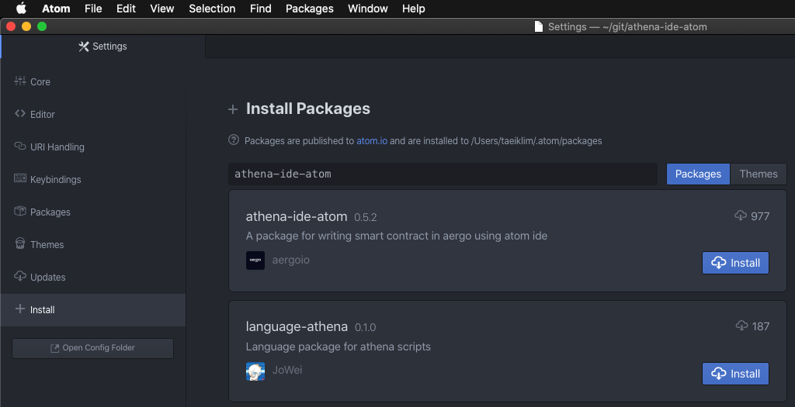
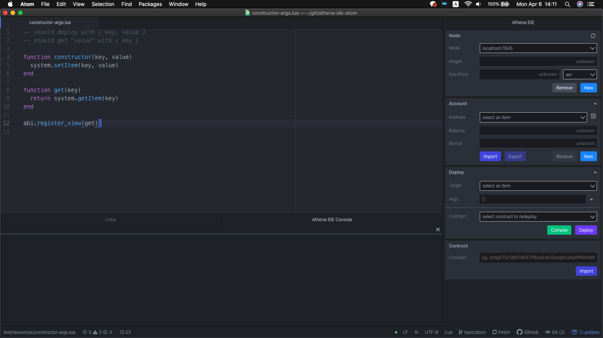
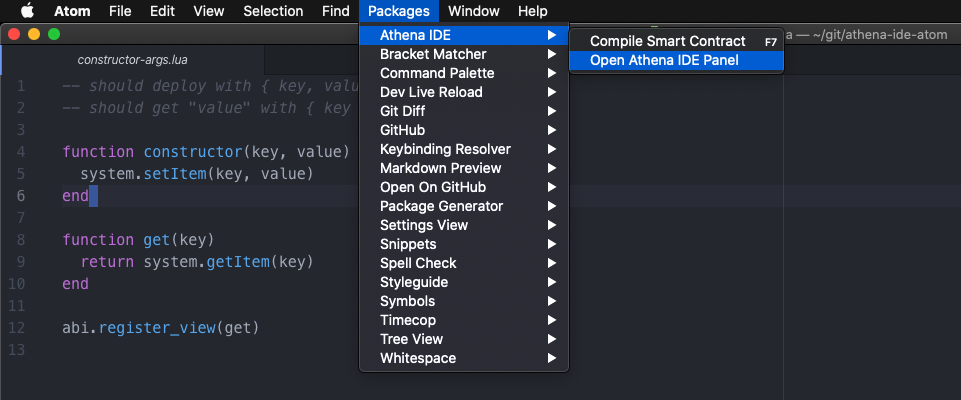
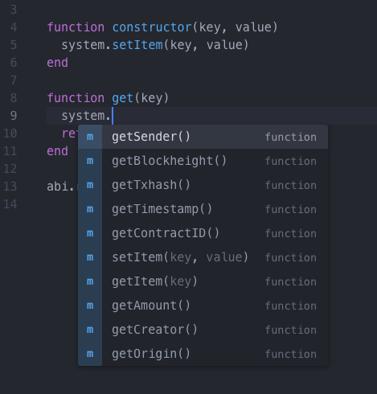
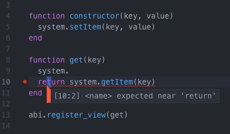

Getting Started
===============

Install
-------

Athena ide atom is based on `atom <https://atom.io/>`_. You have to install it first.

By apm
^^^^^^

Athena ide atom is available in `apm (atom package manager) <https://atom.io/packages/>`_. You can install with it.

Atom -> Preferences -> Install

You can install using cli. For windows user, you can use `git bash <https://git-scm.com/downloads>`_ on cli environment.

.. code-block:: bash

  > apm install athena-ide-atom

By installer
^^^^^^^^^^^^

Installing with apm may be slow on slow network status. So we provide custom installer in releases. Download athena-ide-atom-x.x.x-installer.bin from `releases <https://github.com/aergoio/athena-ide-atom/releases>`_ and run in cli. For windows user, you can use `git bash <https://git-scm.com/downloads>`_ on cli environment.

.. code-block:: bash

  > ./athena-ide-atom-x.x.x-installer.bin

Open
----

Using shortcut
^^^^^^^^^^^^^^

- Mac : Option + Shirt + L
- Windows : Alt + Shirt + L

Using menu bar
^^^^^^^^^^^^^^

Packages -> Athena IDE -> Open Athena IDE Panel

Auto Complete
-------------

Athena ide atom provides some basic autocomplete for lua.

Lint
----

Athena ide atom provides basic lint for lua.

