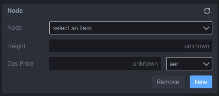
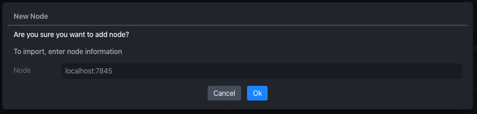
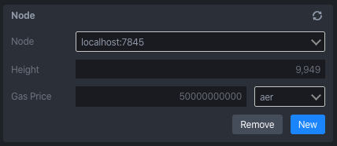
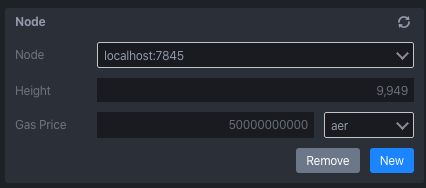
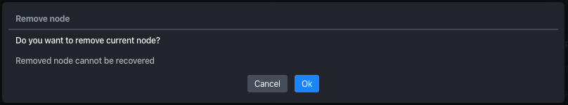
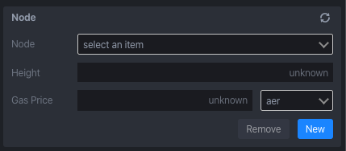

Node
====

You can configure an aergo node whose smart contract interacting with. You can see height and gas price of it. Default configuration is localhost:7845.

New
---

Add new button in a node panel.

Enter node endpoint and click ok.

You can see height and gas price of it.

Remove
------

Click remove button in a node panel.

Click ok button.

Node removed from list.

